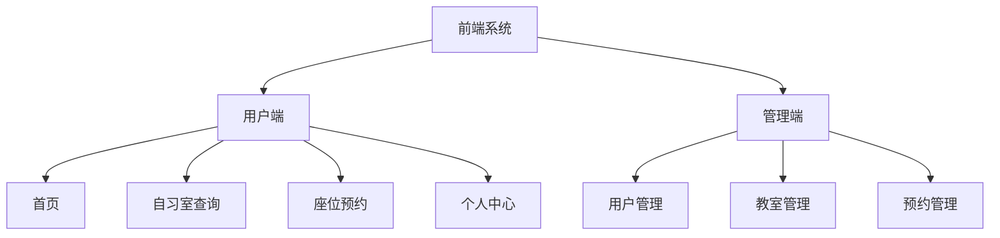

# 架构设计文档

## 一、前端架构说明

本系统前端按照使用角色划分为**用户端**和**管理端**两个子系统。

- **用户端**主要面向普通用户，提供：
  - 自习室查询
  - 座位预约
  - 个人信息管理

- **管理端**主要面向系统管理员，提供：
  - 用户管理
  - 座位管理
  - 预约管理

由于两类用户在功能与权限上存在明显差异，因此在前端架构设计中对其进行模块化划分，并分别设计页面结构，以提高系统整体结构的清晰性与可维护性。

---

## 二、前端架构框图

# 

## 三、后端架构说明

本系统后端采用**分层架构**设计，基于 SpringBoot 实现，按业务职责划分为**接口层、业务逻辑层、数据访问层、公共支撑层**，同时区分**用户业务模块**与**管理业务模块**，保证职责清晰、易于扩展与维护。

- **后端核心职责**

  - 提供前端 HTTP 接口（用户端 / 管理端）
  - 自习室、教室、时段、座位数据管理
  - 预约规则校验、预约创建 / 取消 / 状态更新
  - 用户身份认证与权限控制
  - 黑名单、公告、日志等通用业务处理
  - 数据库事务与数据一致性保障

  

由于用户端与管理端权限边界明确，后端按**模块解耦**设计，同一套底层服务支撑两端接口，避免重复开发，提升复用性。

------

## 四、后端架构框图

------

## 五、后端模块说明

### 3.1 接口层（Controller）

- 接收前端 HTTP 请求
- 参数校验、请求转发
- 返回统一格式 JSON 响应
- 区分用户端 / 管理端接口路径与权限

### 3.2 业务逻辑层（Service）

- 核心业务逻辑实现
- 预约冲突校验、黑名单校验、容量控制
- 事务管理、数据组装与业务规则处理
- 供 Controller 层调用

### 3.3 数据访问层（Dao/Mapper）

- 与数据库交互
- 单表 CRUD、多表关联查询
- 基于 MyBatis/MyBatis-Plus 实现

### 3.4 公共支撑层

- 全局异常捕获与统一返回
- 登录校验、权限拦截
- 时间、字符串、校验等工具类
- 系统日志与操作日志记录

### 3.5 数据存储层

- MySQL 数据库
- 存储用户、教室、时段、预约、黑名单、公告等数据

------

## 六、后端核心业务模块

1. **用户认证模块**：登录、注册、信息修改、会话管理
2. **教室管理模块**：教学楼、教室、可预约时段维护
3. **预约核心模块**：查询可用座位、预约、取消、签到 / 签退（可选）
4. **管理模块**：用户管理、预约审核、违规拉黑、数据统计
5. **系统通用模块**：公告发布、黑名单管理、日志管理

upstream/develop
